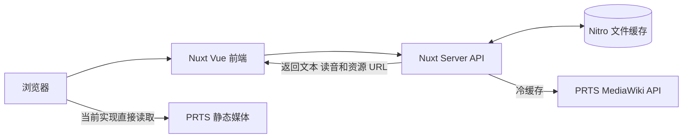

# Ark_of_words

基于《明日方舟》干员语音的日语听写与键盘输入练习 Web 应用

项目使用 Nuxt 4 构建前后端，在服务端按需获取并缓存 PRTS Wiki 数据，将日文台词转换为可供假名和罗马字输入练习的阅读单元

> 项目当前处于 MVP 阶段 尚未提供稳定的公开在线地址

## 功能

- 使用真实干员日语语音进行听写练习
- 支持假名 / 汉字输入和直接罗马字输入
- 逐字符显示正确 错误 多余和待输入状态
- 将简单 中等 困难完整题库随机洗牌后按每五题分组
- 支持查看当前随机队列 原组重练和进入下一组
- 从干员目录自由选择语音组成自定义练习
- 使用 LocalStorage 保存主题和自由配置选择
- 每道新题自动尝试播放当前语音
- 提供键盘焦点管理 动效降级和基础屏幕阅读器语义
- 使用服务端长缓存减少重复请求和上游压力

## 当前支持的干员

- 凯尔希·思衡托
- 伊内丝
- 维什戴尔
- 余
- 黍
- 望

支持范围由服务端白名单控制 后续计划通过管理后台维护干员 语音启用状态 难度覆盖和立绘位置

## 练习模式

### 标准难度

语音按照稳定标题划分为简单 中等和困难

进入练习后完整难度池会先随机洗牌 再按每五题切分

这种方式保证同一轮随机队列内不会重复或遗漏题目

### 自由配置

用户可以在干员页面选择任意已支持语音

选择结果保存在当前浏览器中 刷新后仍可继续编辑或进入练习

## 技术架构



浏览器不会直接请求 PRTS MediaWiki API

Nuxt Server 负责：

- 干员白名单校验
- MediaWiki 请求和响应校验
- PRTS wikitext 解析
- 日文分词 假名 罗马字 原形和词性生成
- Nitro 长缓存和错误边界

浏览器当前会直接读取 PRTS 返回的立绘和音频静态地址

正式公开前需要确认相关静态资源的第三方使用方式

## 技术栈

- [Nuxt 4](https://nuxt.com/) / Vue 3
- TypeScript
- Tailwind CSS 4
- Nitro Server API 与文件缓存
- Kuromoji 日语形态素分析
- WanaKana 假名与罗马字转换
- Docker Compose
- Caddy 反向代理与 HTTPS

## 项目结构

```text
app/
  pages/             页面入口
  components/        展示和局部交互组件
  composables/       前端状态与业务流程
  constants/         难度 题库和显示规则

shared/
  types/             前后端共享 API 类型
  utils/             PRTS 原始数据解析

server/
  api/               Nuxt Server API 路由
  domain/prts/       PRTS 请求和业务标准化
  domain/japanese/   日语读音生成

deploy/              Caddy 配置
```

完整数据流和代码审查顺序见 [`Project_Architecture_Review_Guide.md`](./docs/Project_Architecture_Review_Guide.md)

Nuxt 后端如何自动生效见 [`Nuxt_Backend_In_This_Project.md`](./docs/Nuxt_Backend_In_This_Project.md)

## 本地开发

### 环境要求

- Node.js 22
- npm
- 可以访问 PRTS Wiki 的网络环境

### 安装

```bash
git clone git@github.com:MalloyManga/Ark_of_words.git
cd Ark_of_words
npm install
```

### 启动开发服务器

```bash
npm run dev
```

默认访问地址：

```text
http://localhost:3000
```

### 可用脚本

| 命令 | 作用 |
|---|---|
| `npm run dev` | 启动 Nuxt 开发服务器 |
| `npm run build` | 构建生产 Node Server |
| `npm run preview` | 本地预览生产构建 |
| `npm run generate` | 生成静态输出 当前真实数据接口仍需单独部署 Nuxt Server |
| `npx nuxi typecheck` | 执行 Nuxt TypeScript 检查 |

## Server API

| 方法 | 地址 | 作用 |
|---|---|---|
| `GET` | `/api/health` | 服务健康检查 |
| `GET` | `/api/operators` | 获取支持的干员目录和立绘配置 |
| `GET` | `/api/operators/:operatorId/voices` | 获取单个干员语音和日语阅读单元 |

干员参数必须通过服务端白名单

目录和语音接口使用 30 天缓存 90 天旧数据保留和 SWR

## 部署

仓库包含：

- 多阶段 Node 22 Dockerfile
- Nuxt `node-server` 运行配置
- Docker Compose
- Caddy 反向代理
- HTTPS 和安全响应头配置
- Nitro 缓存持久化卷
- 容器健康检查

雨云 Linux 服务器部署步骤见 [`RAINYUN_DEPLOYMENT.md`](./RAINYUN_DEPLOYMENT.md)

仓库配置只是部署准备 真实服务器仍需完成镜像构建 HTTPS 健康检查 更新回滚和资源监控

## 文档

### 架构与数据

- [`Project_Architecture_Review_Guide.md`](./docs/Project_Architecture_Review_Guide.md)：系统总架构 数据流和代码审查顺序
- [`Nuxt_Backend_In_This_Project.md`](./docs/Nuxt_Backend_In_This_Project.md)：以本项目解释 Nuxt Server API Domain Nitro 和部署运行流程
- [`MediaWiki_API_Learning.md`](./docs/MediaWiki_API_Learning.md)：PRTS MediaWiki API 基础
- [`Architecture_Tutorial_Network_Cache.md`](./docs/Architecture_Tutorial_Network_Cache.md)：缓存 SWR 带宽与上游访问礼仪
- [`Japanese_Reading_Engine.md`](./docs/Japanese_Reading_Engine.md)：Kuromoji 与 WanaKana 加载和生效流程

### 部署与维护

- [`RAINYUN_DEPLOYMENT.md`](./RAINYUN_DEPLOYMENT.md)：雨云 Docker Compose 首次部署手册
- [`Security_And_Concurrency_For_Beginners.md`](./docs/Security_And_Concurrency_For_Beginners.md)：安全 高并发和部署检查
- [`Operator_Admin_Workflow.md`](./docs/Operator_Admin_Workflow.md)：未来干员与立绘后台发布设计
- [`Accessibility_For_Beginners.md`](./docs/Accessibility_For_Beginners.md)：键盘 屏幕阅读器和无障碍验收

## 当前限制

- 尚未完成真实雨云环境部署验证
- PRTS 静态立绘和音频的第三方使用方式仍待确认
- 当前仅支持六位白名单干员
- 管理后台 SQLite 和发布 API 尚未实现
- 可视化音频进度和暂停操作尚未提供
- 形态素原形与词性已经在服务端生成 但尚未完整展示到练习 UI
- 项目保留少量本地 mock 数据用于开发兜底

## 后续计划

- 完成雨云私密部署和真实运维闭环
- 建立干员 语音规则和立绘位置管理后台
- 增加生产日志 监控 回滚和限流验证
- 根据素材授权结果确定静态资源策略
- 将公开读取路径逐步迁移为静态 JSON 与 CDN
- 完成形态素学习信息 UI

## 许可与素材声明

项目作者计划使用 MIT License 发布源码 正式授权范围将以仓库后续提供的独立 `LICENSE` 文件为准

项目涉及的《明日方舟》文本 音频 图片 角色名称和相关素材不包含在 MIT License 授权范围内 其权利归原权利方所有

本项目仅用于非商业学习与技术交流 不对相关游戏素材进行再授权

PRTS Wiki 数据与静态资源的使用应遵守其站点规则和管理方要求
