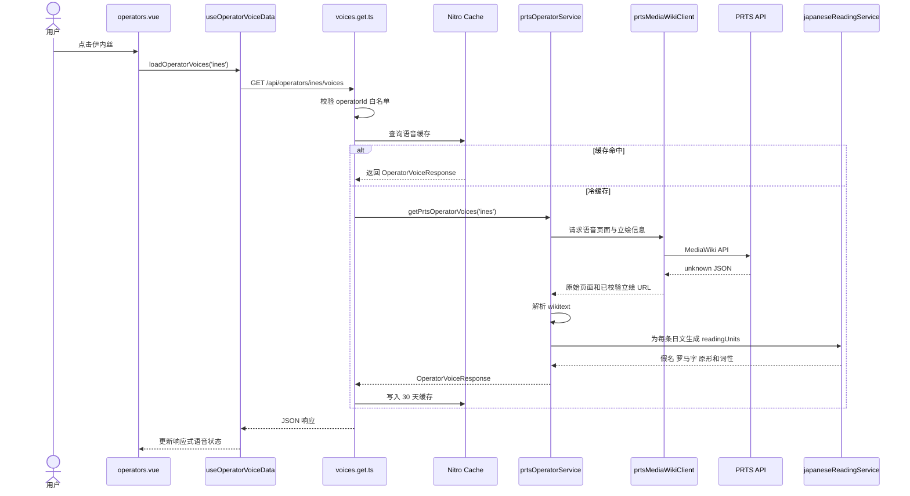
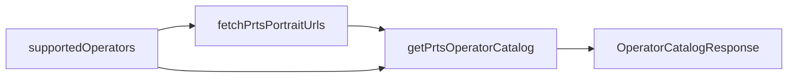
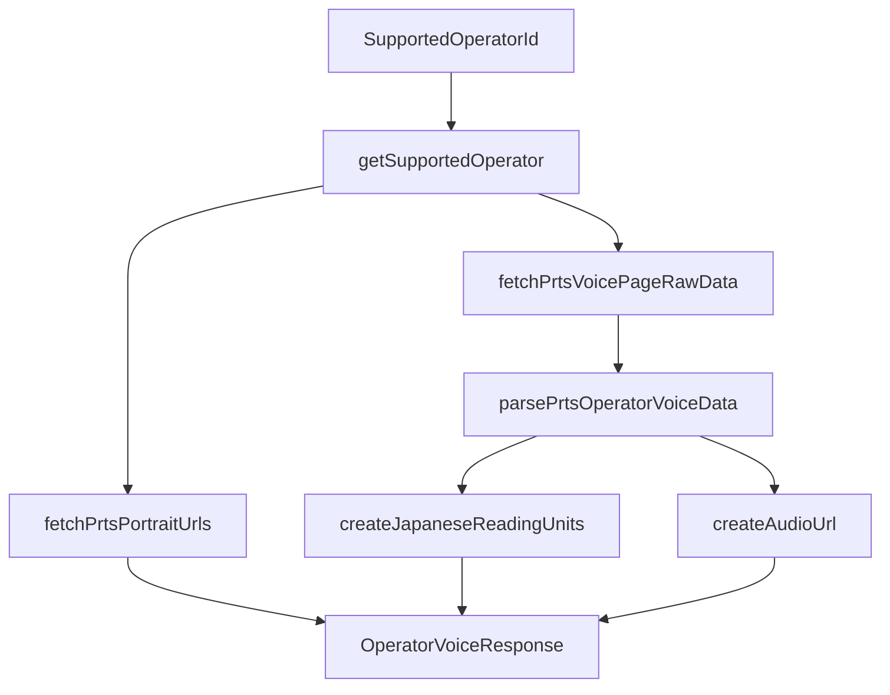
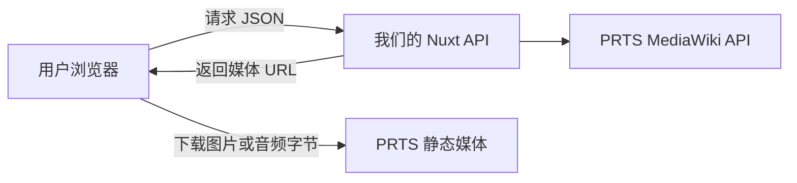
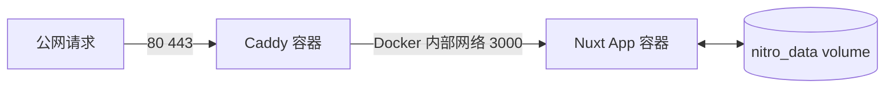

# 用 Ark_of_words 理解 Nuxt 后端

## 1. 先回答最核心的问题

Nuxt 是全栈框架

在这个项目中：

```text
app/       浏览器页面和前端状态
server/    运行在 Node.js 中的后端代码
shared/    前端和后端共同使用的类型与工具
```

你没有看到自己编写的：

```ts
const server = createServer()
server.listen(3000)
```

是因为这部分由 Nuxt 的服务器引擎 Nitro 生成

运行 `npm run dev` 时 Nuxt 同时启动：

- Vite 前端开发环境
- Vue 页面渲染
- Nitro Server API
- 文件路由扫描
- 服务端自动引入

运行 `npm run build` 时 Nuxt 将后端编译成：

```text
.output/server/index.mjs
```

生产环境最终执行的是：

```bash
node .output/server/index.mjs
```

## 2. 一次真实请求经过什么地方

以用户打开伊内丝语音为例：



这条流程就是当前后端的主干

后续阅读每个文件时只需要判断它位于流程中的哪一步

## 3. `server/api` 为什么会自动变成接口

`server/api` 是 Nuxt 约定目录

Nuxt/Nitro 会扫描文件名并生成路由

当前项目映射：

| 文件 | HTTP 接口 |
|---|---|
| `server/api/health.get.ts` | `GET /api/health` |
| `server/api/operators/index.get.ts` | `GET /api/operators` |
| `server/api/operators/[operatorId]/voices.get.ts` | `GET /api/operators/:operatorId/voices` |

文件名中的规则：

```text
index       当前目录根路径
[name]      动态 URL 参数
.get        只接受 GET 方法
.post       只接受 POST 方法
```

例如：

```text
server/api/operators/[operatorId]/voices.get.ts
```

会匹配：

```text
/api/operators/ines/voices
/api/operators/wisadel/voices
```

不会匹配 POST 请求

## 4. API 文件负责什么

API 层是 HTTP 世界与业务代码之间的边界

以语音接口为例 它只负责四件事：

1. 从 URL 读取 `operatorId`
2. 检查它是否属于支持白名单
3. 调用 `getPrtsOperatorVoices`
4. 将内部异常转换为 HTTP 错误

核心结构：

```ts
export default defineCachedEventHandler(async (event) => {
    const operatorId = getRouterParam(event, 'operatorId')

    if (!operatorId || !isSupportedOperatorId(operatorId)) {
        throw createError({ statusCode: 404 })
    }

    return await getPrtsOperatorVoices(operatorId)
})
```

这些函数来自 Nitro/H3：

- `defineCachedEventHandler` 定义带缓存的请求处理器
- `getRouterParam` 读取动态路由参数
- `createError` 创建标准 HTTP 错误

它们由 Nuxt 自动引入 因此文件顶部不需要手动 import

### 为什么 API 文件不直接写所有逻辑

如果请求 PRTS 解析 wikitext 生成读音全部写进 API 文件：

- HTTP 边界和业务规则混在一起
- 纯业务逻辑难以复用
- 文件很难测试和审查
- 将来后台任务无法调用同一服务

因此 API 只做边界工作

## 5. `server/domain` 是什么

`server/domain` 不是 Nuxt 特殊目录

Nuxt不会自动把这里的文件变成 API

它只是项目主动建立的业务层

```text
server/domain/prts/
server/domain/japanese/
```

只有被 API 或其他服务 import 后才会执行

可以把它理解为：

```text
API 层：有人通过 HTTP 找我
Domain 层：真正完成业务任务
```

当前 Domain 分为：

```text
supportedOperators.ts       支持范围和干员配置
prtsMediaWikiClient.ts      与 PRTS HTTP API 通信
prtsOperatorService.ts      组织完整干员业务流程
japaneseReadingService.ts   生成日语阅读单元
```

## 6. `supportedOperators.ts` 的职责

这个文件是当前干员池的服务端配置源

每位干员保存：

- 稳定 ID
- 显示名称
- PRTS 语音页面标题
- PRTS 立绘文件标题
- 独立立绘位置

它同时建立 `Map` 方便按 ID 查找

为什么必须放在服务端：

- 用户不能通过 URL 请求任意 PRTS 页面
- API 只允许项目明确支持的干员
- 立绘和语音页面标题由我们控制
- 防止后端变成通用 PRTS 代理

未来管理后台上线后 这个 TypeScript 数组会逐步替换为 SQLite 配置

但 `getSupportedOperator` 这类业务接口可以保持相似

## 7. `prtsMediaWikiClient.ts` 的职责

这个文件只负责和 PRTS MediaWiki API 通信

它不知道练习难度 题库和 Vue 页面

### 固定上游地址

```ts
const PRTS_MEDIAWIKI_API_URL = 'https://prts.wiki/api.php'
```

用户不能传入任意 URL

### 请求礼仪

每次请求设置：

- 明确 User-Agent
- 10 秒超时
- `retry: 0`

这样 PRTS 临时失败时不会连续重试放大压力

### 为什么返回 `unknown`

```ts
return await $fetch<unknown>(...)
```

网络返回的 JSON 在运行时不可信

TypeScript 泛型不能验证服务器实际返回了什么

因此先使用 `unknown` 接收 再通过：

```ts
const isRecord = (value: unknown): value is Record<string, unknown>
```

逐层检查 `query.pages` 和 `imageinfo`

### 静态资源 URL 校验

立绘地址必须满足：

- 协议是 HTTPS
- 主机是 `prts.wiki` 或其子域名

这是防止上游异常数据让浏览器或服务器访问不受信任地址

## 8. `prtsOperatorService.ts` 的职责

这个文件是 PRTS 业务编排层

它把多个小步骤组合成页面真正需要的稳定 DTO

## 8.1 目录流程



目录响应包含：

- 干员 ID
- 显示名称
- 立绘 URL
- 立绘位置

前端不需要理解 PRTS 的 `imageinfo` 格式

## 8.2 单个干员语音流程



这个服务还负责：

- 验证 PRTS 返回的干员名称是否符合配置
- 将 `.wav` 元数据转换为实际 `.mp3` 播放地址
- 对资源路径逐段编码
- 拒绝空路径 `.` 和 `..`
- 为每条语音附加 readingUnits

## 9. `shared` 为什么前后端都能使用

Nuxt 提供 `shared/` 目录和 `#shared` 别名

这里的代码可以同时被前端和服务端引用

当前内容：

```text
shared/types/operatorApi.ts
shared/types/japaneseReading.ts
shared/utils/prtsVoiceDataExtractor.ts
```

### 类型契约

`OperatorVoiceResponse` 同时告诉：

- 后端应该返回什么
- 前端应该接收什么

这样接口字段改名时 Type Check 能发现两边不一致

但必须记住：

```text
TypeScript 类型只在编译阶段存在
网络数据仍然需要运行时检查
```

### 共享解析器

`prtsVoiceDataExtractor.ts` 接收 MediaWiki 原始响应

输出项目内部稳定的：

- 干员名称
- voiceKey
- 音频基础路径
- 日文和中文语音行

它不发网络请求 只做数据转换

因此可以使用本地 mock JSON 审查解析结果

## 10. `japaneseReadingService.ts` 如何生效

这个文件只运行在服务端

因为：

- Kuromoji 词典约 16 MB
- 每个浏览器重复下载和初始化成本很高
- 日文台词基本不变化
- 结果适合生成一次后长期缓存

## 10.1 进程级懒加载

```ts
let tokenizerInitialization: Promise<Tokenizer<IpadicFeatures>> | undefined
```

第一次请求需要读音时创建 Promise

同一 Node 进程后续请求复用它

如果初始化失败则清除 Promise 允许下一次重试

这叫进程级缓存

它和 Nitro 数据缓存不是同一个东西

## 10.2 阅读单元

每个 `JapaneseReadingUnit` 包含：

- 原文片段
- 假名
- 罗马字
- 原形
- 词性

Kuromoji 负责分词 读音 原形和词性

WanaKana 负责假名转罗马字

项目额外处理：

- `ん` 转换为 IME 需要的 `nn`
- 小 `っ` 参考下一个 token 生成促音辅音
- 空格和标点不产生可输入罗马字
- 阅读单元重新拼接后仍与原文对齐

详细算法见 `Japanese_Reading_Engine.md`

## 11. Nitro 缓存如何生效

API 使用：

```ts
defineCachedEventHandler(handler, cacheOptions)
```

语音接口配置：

```text
name: operator-voices-with-ime-readings
group: prts
key: operatorId
maxAge: 30 天
staleMaxAge: 90 天
swr: true
```

## 11.1 冷缓存

第一次请求伊内丝：

```text
没有缓存
→ 请求 PRTS
→ 解析全部语音
→ 生成 readingUnits
→ 保存响应
```

这一次最慢

## 11.2 热缓存

后续请求伊内丝：

```text
读取已保存 OperatorVoiceResponse
→ 不重新请求 PRTS
→ 不重新运行 Kuromoji
```

## 11.3 SWR

缓存过期但仍在允许的旧数据时间内：

```text
先返回旧数据
→ 后台尝试刷新
```

用户不必一直等待上游

## 11.4 文件缓存位置

`nuxt.config.ts` 配置：

```ts
storage: {
    cache: {
        driver: 'fs',
        base: './.data/cache',
    },
}
```

Docker 将 `/app/.data` 挂载为 named volume

因此普通容器更新不会删除缓存

## 12. 前端如何调用后端

## 12.1 `useFetch`

干员目录使用：

```ts
useFetch<OperatorCatalogResponse>('/api/operators')
```

`useFetch` 是 Nuxt composable

它理解 SSR 数据载荷和组件生命周期

页面首次渲染时 Nuxt 可以在服务端完成请求 并把结果随页面状态交给浏览器

## 12.2 `$fetch`

用户点击干员后使用：

```ts
$fetch<OperatorVoiceResponse>(`/api/operators/${operatorId}/voices`)
```

这是一次按事件触发的普通异步请求

响应写入 `useState` 会话缓存

同一个 Nuxt 应用会话中再次打开该干员不需要重新请求

## 12.3 三层缓存不要混淆

```text
Kuromoji Promise     Node 进程级初始化缓存
Nitro 文件缓存       服务器长期数据缓存
Nuxt useState        当前前端应用会话缓存
LocalStorage         当前浏览器长期偏好
```

它们解决的问题不同

## 13. 错误如何从后端流向前端


无效干员属于用户输入问题 返回 404

PRTS 临时失败属于上游问题 返回 502

API 不应把本地文件路径和完整内部堆栈直接返回给公众

服务器日志保留可定位的错误信息

前端只保存适合展示或恢复的错误状态

## 14. 立绘和音频为什么不经过 API

当前 API 返回的是 URL：

```text
portraitUrl
audioUrl
```

实际文件流向：



优点：

- 不消耗我们的音频中转带宽
- Nuxt API 不需要处理 Range 请求
- 服务器成本低

风险：

- 浏览器流量直接消耗 PRTS 静态资源
- 必须确认第三方直链规则
- PRTS 静态资源不可用时用户无法播放

没有得到许可前不应把“没有回复”理解为允许公开扩大流量

## 15. 开发环境和生产环境有什么不同

## 15.1 开发环境

执行：

```bash
npm run dev
```

Nuxt 启动开发服务器：

- Vite 提供前端 HMR
- Nitro 扫描 Server API
- 修改文件后重新加载对应模块
- 浏览器和后端运行在同一个开发入口

## 15.2 生产构建

执行：

```bash
npm run build
```

Nuxt 生成：

```text
.output/server/
.output/public/
```

生产服务器不运行 Vite

它执行编译后的 Nitro Node Server

## 16. Docker 和 Caddy 如何连接后端



### Dockerfile

三个阶段：

1. `dependencies` 使用 `npm ci` 安装锁定依赖
2. `build` 执行 Nuxt build 并检查 Kuromoji 词典
3. `runtime` 只复制 `.output` 并使用非 root 用户运行

### Compose

定义：

- `app` Nuxt 服务
- `caddy` 公网反向代理
- `web` Docker 内部网络
- `nitro_data` 缓存持久化卷
- `caddy_data` HTTPS 证书数据

### Caddy

Caddy 负责：

- 公网 80 和 443
- 自动 HTTPS
- gzip 和 zstd 压缩
- 反向代理到 `app:3000`
- 基础安全响应头

Nuxt 的 3000 端口没有映射到宿主机公网

## 17. 后端代码应该怎样审

不要一次阅读整个 `server/`

按照一条请求拆成七步

## 第一步 看响应类型

```text
shared/types/operatorApi.ts
```

先回答：前端最终需要什么

不要先陷入 MediaWiki JSON

## 第二步 看白名单

```text
server/domain/prts/supportedOperators.ts
```

回答：项目允许请求谁 每位干员配置什么

## 第三步 看 API 入口

```text
server/api/operators/[operatorId]/voices.get.ts
```

回答：URL 参数如何变成受控 ID 错误如何变成 HTTP 状态

## 第四步 看业务编排

```text
server/domain/prts/prtsOperatorService.ts
```

回答：一次语音响应由哪些步骤组成

## 第五步 看外部请求

```text
server/domain/prts/prtsMediaWikiClient.ts
```

回答：外部数据如何校验 超时和域名边界是什么

## 第六步 看解析和读音

```text
shared/utils/prtsVoiceDataExtractor.ts
server/domain/japanese/japaneseReadingService.ts
```

回答：原始内容如何变成内部稳定对象

## 第七步 看缓存和部署

```text
server/api/
nuxt.config.ts
Dockerfile
compose.yaml
deploy/Caddyfile
```

回答：结果保存在哪里 进程如何启动 请求如何进入容器

## 18. 每个文件使用同一套问题

```md
这个文件属于哪一层：

谁调用它：

输入是什么：

输出是什么：

输入是否可信：

有什么网络 磁盘或进程副作用：

失败后抛出什么错误：

结果在哪里缓存：
```

只要能回答这些问题 就已经理解了该后端模块的主要职责

## 19. 本地观察后端的方法

由开发者本人启动：

```bash
npm run dev
```

然后单独访问：

```text
http://localhost:3000/api/health
http://localhost:3000/api/operators
http://localhost:3000/api/operators/ines/voices
```

观察顺序：

1. 先看浏览器 Network 中的 Request URL 和 Status
2. 再看 Response JSON
3. 再看运行 Nuxt 的终端日志
4. 最后回到对应 API 和 Domain 文件

不要一开始就在整个项目里全局搜索错误

先确定失败位于：

```text
浏览器请求
API 参数
Nitro 缓存
PRTS 网络
解析器
Kuromoji
前端状态
```

## 20. 常见术语

| 术语 | 在本项目中的含义 |
|---|---|
| Nuxt | 组织 Vue 前端和 Nitro 后端的全栈框架 |
| Nitro | 构建并运行 Nuxt 服务端的引擎 |
| H3 | Nitro 使用的轻量 HTTP 工具层 |
| Server API | `server/api` 自动生成的 HTTP 接口 |
| Domain | 项目自己划分的业务逻辑层 不是 Nuxt 魔法目录 |
| DTO | API 返回给前端的稳定数据对象 |
| SSR | 在服务器生成页面初始内容和数据 |
| `$fetch` | Nuxt/Ofetch 提供的请求函数 |
| `useFetch` | 结合 Nuxt 生命周期和 SSR 的数据请求 composable |
| Cache | 保存已经计算或获取的结果 |
| TTL | 缓存有效时间 |
| SWR | 先使用旧缓存再后台刷新 |
| Cold Cache | 第一次没有缓存 必须请求和计算 |
| Warm Cache | 已有缓存 可以直接返回 |
| Reverse Proxy | Caddy 接收公网请求再转发给 Nuxt |

## 21. 最后用一句话记住每层

```text
server/api
把 HTTP 请求挡在业务逻辑外

server/domain/prts
把 PRTS 数据变成项目数据

server/domain/japanese
把日文台词变成可练习的阅读单元

shared
让前后端对同一数据结构达成一致

Nitro Cache
让昂贵处理不必每次重复

Docker
把构建后的 Nuxt Server 放进稳定运行环境

Caddy
把公网 HTTPS 请求安全地交给 Nuxt
```

理解顺序永远是：

```text
先看输入和输出
→ 再看业务流程
→ 再看外部副作用
→ 最后看框架如何自动装配
```
