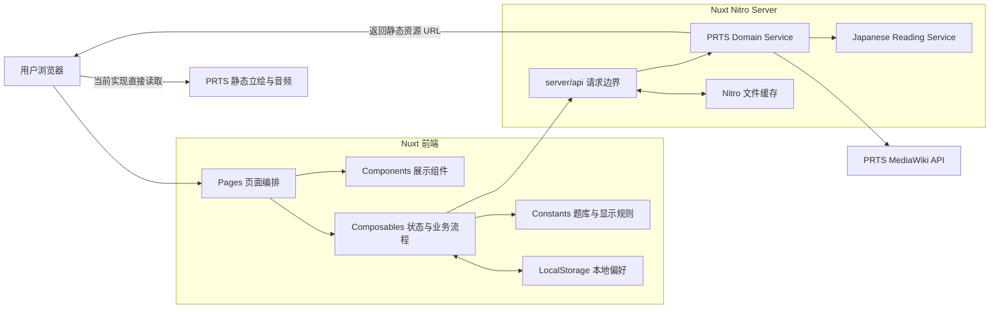
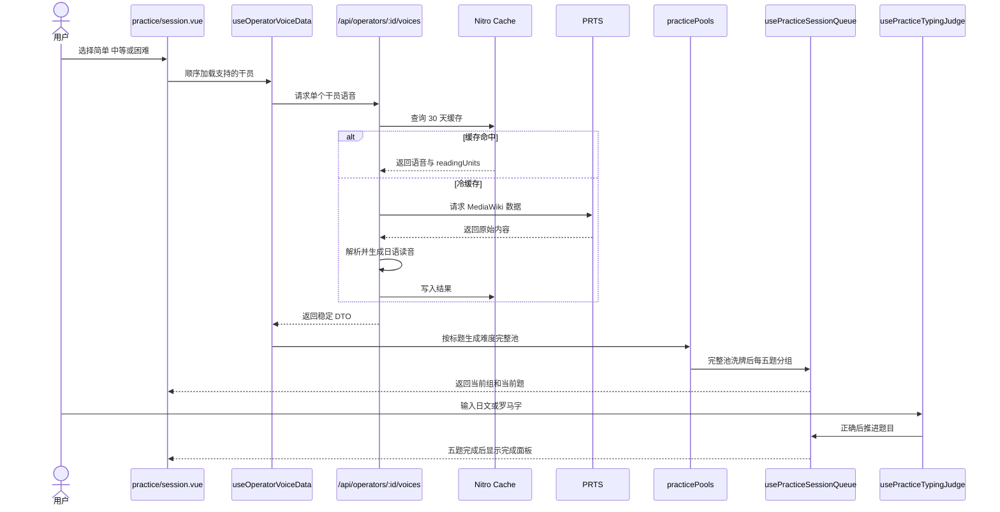
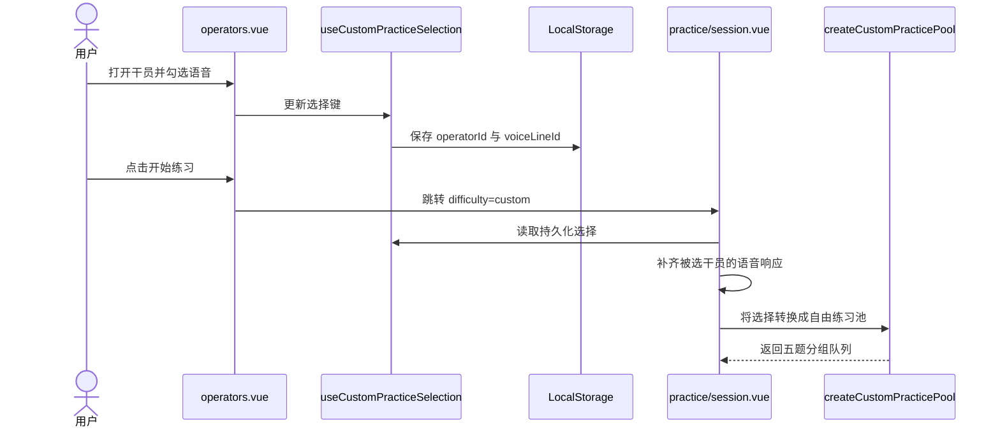
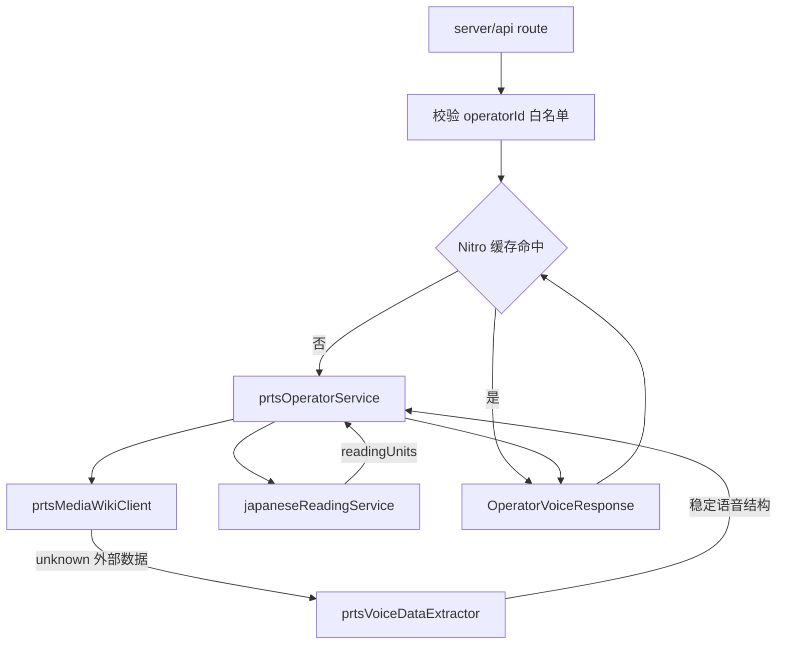
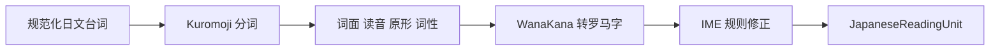
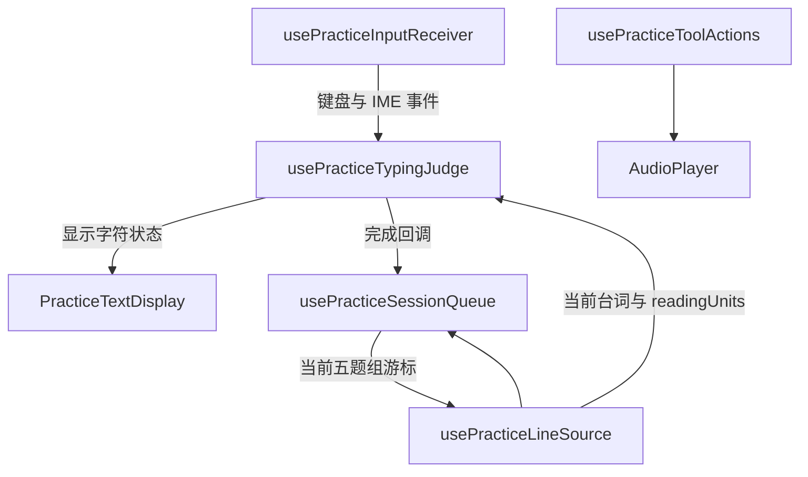
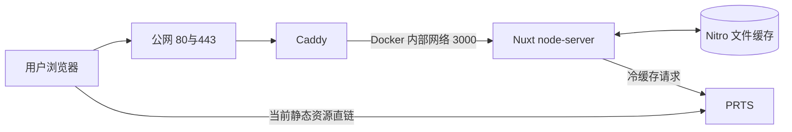
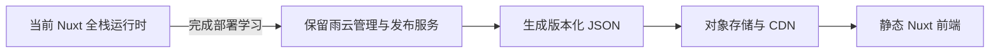

# Ark_of_words 项目架构与代码审查指南

## 1. 先建立项目全景

Ark_of_words 是一个使用明日方舟干员语音练习日语听写和键盘输入的 Nuxt 全栈项目

当前架构同时承担两个目标：

1. 提供可以使用的五题分组练习 MVP
2. 学习前端 Server API 缓存 Docker 反向代理和部署运维

因此当前实现不是最轻的纯静态方案

它是一套有意保留服务端数据处理和部署环节的学习型架构

## 2. 系统总架构



最重要的数据边界：

- 浏览器不直接请求 PRTS MediaWiki API
- Nuxt Server 负责白名单校验 解析 读音生成和缓存
- 浏览器当前直接读取 PRTS 立绘与音频 URL
- LocalStorage 只保存主题和自由配置选择 不保存大体积素材

## 3. 目录职责

```text
app/pages/          页面入口和模块编排
app/components/     纯展示或局部交互组件
app/composables/    前端状态 异步请求和业务流程
app/constants/      难度 题库 显示模式和稳定映射
app/types/          前端展示模型
app/utils/          DTO 到展示模型的纯转换

shared/types/       前后端共享 API 契约
shared/utils/       前后端共享的 PRTS 原始数据解析

server/api/         HTTP 参数校验 缓存和错误响应
server/domain/prts/ PRTS 请求 白名单和业务标准化
server/domain/japanese/ 日语分词 假名 罗马字 原形和词性

deploy/             Caddy 配置
Dockerfile          镜像构建和运行边界
compose.yaml        Nuxt Caddy 网络和持久化卷
```

审查时如果发现职责跨层 应重点检查

例如：

- 页面不应该解析 PRTS wikitext
- API handler 不应该包含大量 UI 规则
- 展示组件不应该自己请求后端
- 外部未知 JSON 不应该直接断言成内部类型

## 4. 两条主要用户流程

## 4.1 标准难度练习



审查重点：

1. 标准难度是否只接受受控 query
2. 六位干员是否顺序加载而不是瞬间并发
3. 难度映射是否按稳定标题而不是脆弱数组下标
4. 完整池是否先洗牌再每五题切组
5. 五题内是否没有重复
6. 再次练习是否保持原组顺序
7. 下一组是否继续使用同一轮随机队列

## 4.2 自由配置练习



审查重点：

1. LocalStorage 数据是否经过版本和运行时校验
2. 是否只保存选择键而不是完整音频和文本
3. 删除和清空是否立即同步唯一状态源
4. 刷新后是否能补齐语音详情
5. 没有有效选择时是否返回配置页

## 5. 服务端数据流



这里是整个项目最值得优先审查的安全边界

检查：

- 外部响应是否先用 `unknown` 接收
- MediaWiki 缺字段时是否明确报错
- 媒体 URL 是否只允许 HTTPS 和 PRTS 域名
- 路径是否拒绝空段 `.` 和 `..`
- 请求是否有 User-Agent 10 秒超时和零重试
- API 是否把内部错误转成稳定的 4xx 或 5xx
- 缓存 key 是否随数据结构升级

## 6. 日语读音引擎



关键规则：

- Kuromoji 词典只在服务端进程首次需要时懒加载
- `ん` 使用输入法需要的 `nn`
- 小 `っ` 需要参考下一个 token 推导重复辅音
- 空格和标点保留 sourceText 但不产生可输入 romajiText
- readingUnits 与语音响应一起进入长期缓存

详细说明见 `Japanese_Reading_Engine.md`

## 7. 前端练习状态拆分



各模块边界：

- `usePracticeInputReceiver` 只处理浏览器输入和 IME 事件顺序
- `usePracticeTypingJudge` 只处理提交文本 字符状态 删除和完成判断
- `usePracticeLineSource` 连接题库数据与当前题
- `usePracticeSessionQueue` 只处理随机分组和游标
- `AudioPlayer` 只封装 HTML5 Audio API
- 页面负责把模块连接起来

审查时不要只看最终颜色

应使用具体输入检查状态：

```text
目标 しんだ
输入 しぬか
预期 前段正确 后段错误

目标两字符
输入三字符
预期 第三个字符是 extra

删除错误字符
预期 已提交文本回退并允许重新输入
```

## 8. 状态保存位置

| 状态 | 保存位置 | 生命周期 |
|---|---|---|
| 当前输入和光标 | Vue ref | 当前题 |
| 当前五题组游标 | Vue ref | 当前页面会话 |
| 已加载语音响应 | Nuxt useState | 当前 Nuxt 应用会话 |
| 自由配置选择 | LocalStorage + useState | 浏览器长期 |
| 主题偏好 | LocalStorage + useState | 浏览器长期 |
| PRTS 文本与读音 | Nitro 文件缓存 | 服务器长期 |
| 音频和立绘文件 | 当前不保存 | 用户浏览器直连 PRTS |

审查状态时先问三个问题：

1. 谁是唯一数据源
2. 刷新页面后应不应该存在
3. 是否把大体积或敏感数据放错位置

## 9. 部署架构



Docker 边界：

- Caddy 是唯一公网入口
- Nuxt 3000 端口不暴露公网
- Nuxt 使用非 root 用户运行
- `/app/.data` 通过 named volume 持久化
- Caddy 自动压缩并负责 HTTPS
- `/api/health` 用于容器健康检查

## 10. 推荐代码审查顺序

不要从 `pages` 开始逐行审

推荐分八轮 每轮只回答一组问题

### 第一轮 共享契约

文件：

```text
shared/types/operatorApi.ts
shared/types/japaneseReading.ts
shared/utils/prtsVoiceDataExtractor.ts
```

目标：理解系统传递的业务对象

检查类型是否表达真实字段 外部数据是否经过运行时校验

### 第二轮 外部数据边界

文件：

```text
server/domain/prts/supportedOperators.ts
server/domain/prts/prtsMediaWikiClient.ts
server/domain/prts/prtsOperatorService.ts
```

目标：理解我们如何安全访问 PRTS 并转换数据

### 第三轮 读音和缓存

文件：

```text
server/domain/japanese/japaneseReadingService.ts
server/api/operators/index.get.ts
server/api/operators/[operatorId]/voices.get.ts
nuxt.config.ts
```

目标：理解冷缓存 热缓存 Kuromoji 生命周期和 API 错误边界

### 第四轮 前端数据加载

文件：

```text
app/composables/useOperatorVoiceData.ts
app/composables/useOperatorBrowserData.ts
app/composables/useOperatorVoiceResponseCache.ts
app/utils/operatorDisplayAdapter.ts
```

目标：理解目录 按需语音加载 请求去重和 DTO 适配

### 第五轮 题库与队列

文件：

```text
app/constants/practiceDifficulties.ts
app/constants/practicePools.ts
app/composables/usePracticeSessionQueue.ts
app/composables/usePracticeLineSource.ts
```

目标：理解难度分类 完整池 洗牌 五题分组和完成状态

### 第六轮 输入状态机

文件：

```text
app/composables/usePracticeInputReceiver.ts
app/composables/usePracticeTypingJudge.ts
app/constants/practiceCharacterStatus.ts
```

目标：理解 IME 罗马字 删除 错误锁定和字符颜色

这一轮风险最高 应使用具体输入案例逐步推演

### 第七轮 页面与组件

文件：

```text
app/pages/operators.vue
app/pages/practice/session.vue
app/components/operator/
app/components/practice/
```

目标：确认页面只做编排 组件没有偷偷重复业务逻辑 UI 与现有设计一致

### 第八轮 工程与部署

文件：

```text
Dockerfile
compose.yaml
deploy/Caddyfile
RAINYUN_DEPLOYMENT.md
docs/Security_And_Concurrency_For_Beginners.md
docs/Accessibility_For_Beginners.md
```

目标：理解公网入口 容器网络 持久化 健康检查 安全头和人工验收

## 11. 每轮审查模板

每看一个模块只记录以下内容：

```md
模块目标：

输入来自哪里：

输出给谁：

唯一状态源：

外部副作用：

失败时如何恢复：

我不理解的命名或逻辑：

我想手动测试的案例：
```

如果一个文件无法用这几项解释清楚 说明它可能职责过多或注释不足

## 12. 使用 Git 按模块审查

项目保留了细粒度分支和提交

常用只读命令：

```bash
git branch
git log --oneline --decorate --graph --all
git show <commit>
git diff main...<branch>
git blame <file>
```

推荐：

1. 先阅读本指南对应模块
2. 用 `git log` 找模块提交
3. 用 `git show` 只看一次小改动
4. 回到当前 main 看最终形态
5. 写下为什么从旧结构演进到当前结构

不要在第一次审查时同时修改大量命名和 UI

先理解数据流 再分支修改

## 13. 当前已知边界

以下内容不能被误认为已经完成：

- PRTS 对静态立绘和音频直链尚未确认
- 真实雨云 Docker 构建和公网部署尚未执行
- 管理后台 SQLite 和发布 API 只有设计文档
- 完整 CSP 和真实流量限流尚未配置
- 压力测试尚未执行
- 无障碍代码已接入但仍需要浏览器和屏幕阅读器人工验收
- 当前还保留本地 mock 数据作为真实池不可用时的开发兜底

## 14. 从学习架构迁移到最终最佳实践

完成一次真实部署运维闭环后 可以逐步迁移



适合开始迁移的条件：

1. 已完成一次服务器创建 Docker 部署 HTTPS 更新和回滚
2. 已理解 Nitro 缓存 日志和健康检查
3. 已获得 PRTS 对数据与静态资源使用方式的明确答复
4. 已确定对象存储中允许保存哪些内容
5. 已完成后台配置发布的基本模型

迁移后普通用户主要读取 CDN 静态 JSON

雨云服务器只负责后台管理 数据生成和发布

这样可以同时保留学习成果并获得更低成本 更快访问和更高稳定性

## 15. 文档阅读顺序

建议按以下顺序学习：

1. `README.md` 了解目标和当前阶段
2. 本文了解项目总架构和审查顺序
3. `MediaWiki_API_Learning.md` 了解上游数据来源
4. `Architecture_Tutorial_Network_Cache.md` 了解缓存和带宽
5. `Japanese_Reading_Engine.md` 了解读音生成
6. `RAINYUN_DEPLOYMENT.md` 执行首次部署
7. `Security_And_Concurrency_For_Beginners.md` 理解公网风险
8. `Accessibility_For_Beginners.md` 完成人工体验验收
9. `Operator_Admin_Workflow.md` 规划部署后的后台

每读完一份文档 再回到对应代码模块审查

不要试图一次记住整个项目
